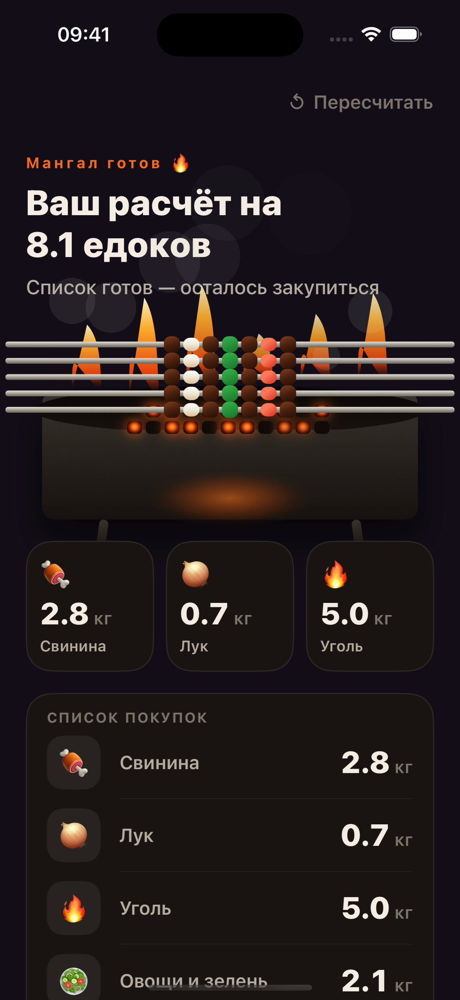

# 🔥 Шашлыкатор

**Сколько шашлыка нужно на компанию?** Шашлыкатор помогает быстро прикинуть продукты для выезда на природу: ответьте на пять вопросов, нанижите виртуальный шампур и получите список покупок.

> Сделано по фану, чисто поржать. Расчёты — удобная прикидка, а не точная наука. 🍢

  

<a href="docs/media/demo.mp4">Смотреть полную демонстрацию →</a>

## Как это работает

1. Укажите число взрослых и будут ли дети.
2. Выберите напитки, аппетит компании и вид мяса.
3. Проведите пальцем по шампуру, чтобы завершить расчёт.
4. Посмотрите количества мяса, лука, угля, овощей, напитков, лаваша и соусов. Результатом можно поделиться через системное меню iOS.

Расчёт ориентировочный: приложение использует фиксированные нормы и округляет количества до удобных значений. Перед покупкой учитывайте реальные предпочтения гостей и длительность встречи.

## Экраны

  
  &nbsp;
  
  &nbsp;
  

## Запуск

- macOS и Xcode с установленным iOS Simulator;
- iOS 17.5 или новее для запуска на устройстве.

Откройте `Kebapp.xcodeproj`, выберите схему **Kebapp** и запустите её на iPhone Simulator или своём устройстве. Для запуска на устройстве может потребоваться выбрать свою команду разработчика в настройках подписи Xcode.

## Что внутри

- **UIKit**: экраны, анимации и тактильная отдача;
- **Swift**: модель расчёта и логика прохождения вопросов;
- `index.html`: отдельный интерактивный прототип интерфейса для просмотра в браузере.

Основной поток приложения находится в `Kebapp/ViewModels/CalculatorViewModel.swift`, а правила расчёта — в `Kebapp/Models/CalculatorModel.swift`.

## Статус

Демонстрационная версия. Кнопка «Сохранить» на экране результата пока не подключена; сохранение расчётов и история не входят в текущий рабочий сценарий.
